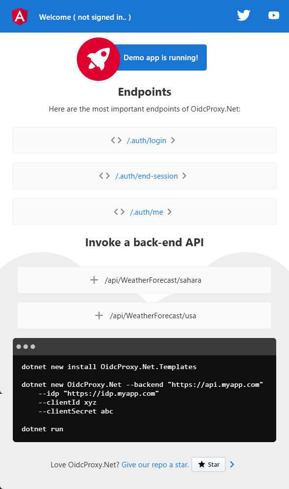

# Keycloak / SPA+BFF / API demo

This demo consists of three parts:

- Keycloak, to authenticate users
- A SPA, hosted in an ASP.NET Core BFF (the OidcProxy)
- An ASP.NET Core API

Prerequisites to run this demo:

- A functioning [Keycloak](https://www.keycloak.org/) instance
- [Download and install the .NET 8 SDK](https://dotnet.microsoft.com/en-us/download)
- [Download and install NodeJS/NPM](https://nodejs.org/en/download)
- [Install the Angular CLI](https://angular.io/cli)
- Create a Keycloak client and configure it as described [here](readme-keycloak.md).

## How the demo works:
```mermaid
sequenceDiagram

    Browser -->> OidcProxy: Request /dist to initiate the SPA
    OidcProxy -->> Browser: SPA binaries
    Browser -->> OidcProxy: SPA navigates user to /.auth/login
    OidcProxy -->> Keycloak: Redirect to openid-connect/auth endpoint
    Keycloak -->> Keycloak: Authenticate the user
    Keycloak -->> OidcProxy: Redirect to OidcProxy with authorization code
    OidcProxy -->> Keycloak: Obtain access_token, refresh_token and id_token
    Browser -->> OidcProxy: Redirect to /dist to initiate the SPA
    OidcProxy -->> Browser: SPA binaries
    Browser -->> OidcProxy: SPA invokes /api/weatherforecast
    OidcProxy -->> API: Adds access_token to request and forwards it via YARP
    API -->> OidcProxy: API Response
    OidcProxy -->> Browser: API Response
```

## Configure the demo

Configure the BFF:
* Open spa+bff/appsettings.json with your favourite editor.
* Replace {yourClientId} with the Client ID you have configured in Keycloak.
* Replace {yourClientSecret} with the Client Secret generated by Keycloak.
* Replace {yourAuthority} with the Keycloak URL, including realm, e.g. "https://my-keycloak-server:8888/realms/MyRealm.
* Replace {yourAudience} with something descriptive of your API (the audience will not be validated in this demo).

Configure the API:
* Open api/appsettings.json with your favourite editor.
* Replace {yourAuthority} with the same value as the spa+bff setting.
* Replace {yourIssuer} with the hostname part of the Keycloak URL, e.g. "my-keycloak-server:8888".

## Run the demo using Visual Studio

* Open demo.sln
* Right-click on the `Api` project and select Debug → Start new instance.
* Right-click on the `spa+bff` project and select Debug → Start new instance.

## Or run the demo using the CLI

* Open a terminal window or a command prompt
* Navigate to api/
* Type `dotnet restore`
* Type `dotnet run`

* Open another terminal window or a command prompt
* Navigate to spa+bff/
* Type `dotnet restore`
* Type `dotnet run`

* Open a browser and navigate to https://localhost:8444

## Result

If you've followed these steps correctly, you should see the below. Click the `login` link to authenticate with Keycloak. If successful, the user name will be shown.

## Issues

Not working? Missing features? Create an [issue](https://github.com/oidcproxydotnet/oidcproxy.net/issues).